 
<h3 align='center'>Trailer</h3>

 
 

   
    
    
  

  <a href="https://verbic.web.app">
    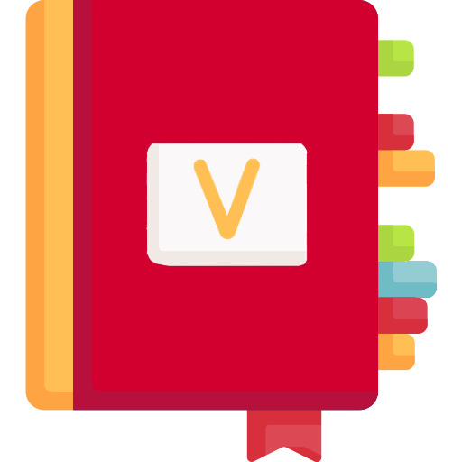
  </a>

  <h3 align="center">Verbic</h3>

  
  

    An awesome all-in-one dictionary
     
    <a href="https://github.com/RishiAhuja/dictionary"><strong>Explore the docs »</strong></a>
     
     
    <a href="https://verbic.web.app">Use now</a>
    ·
    <a href="mailto:www.rishiahuja@gmail.com">Report Bug</a>
    ·
    <a href="mailto:www.rishiahuja@gmail.com">Request Feature</a>
  

<!-- ABOUT THE PROJECT -->
## Light mode
<a href="https://raw.githubusercontent.com/RishiAhuja/dictionary/master/assets/readme/light/1.png">
    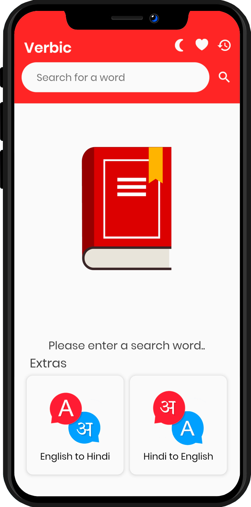
  </a>
<a href="https://raw.githubusercontent.com/RishiAhuja/dictionary/master/assets/readme/light/2.png">
    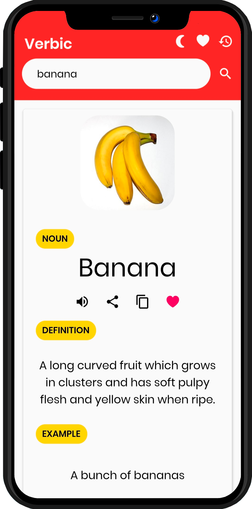
  </a>
<a href="https://raw.githubusercontent.com/RishiAhuja/dictionary/master/assets/readme/light/3.png">
    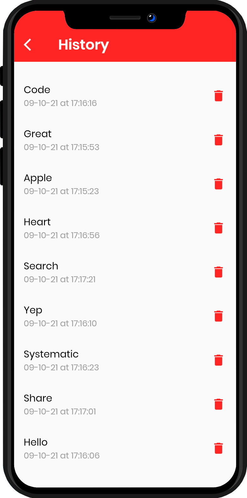
  </a>
  <a href="https://raw.githubusercontent.com/RishiAhuja/dictionary/master/assets/readme/light/4.png">
    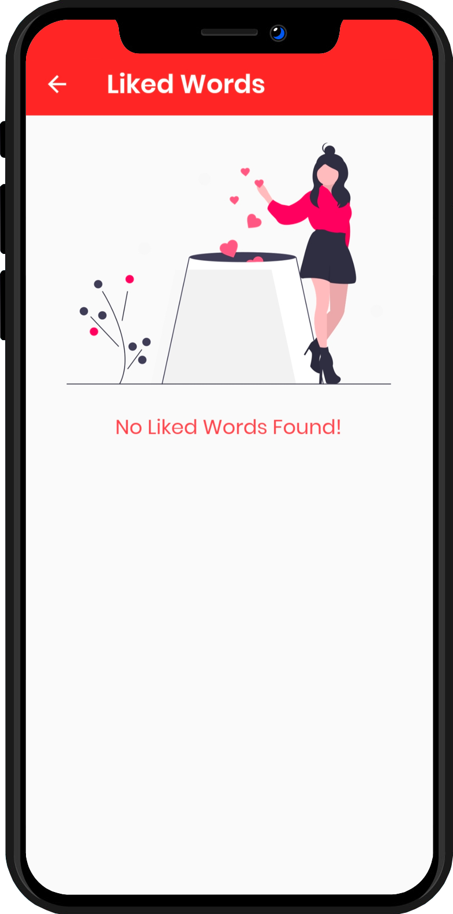
  </a>
  <a href="https://raw.githubusercontent.com/RishiAhuja/dictionary/master/assets/readme/light/5.png">
    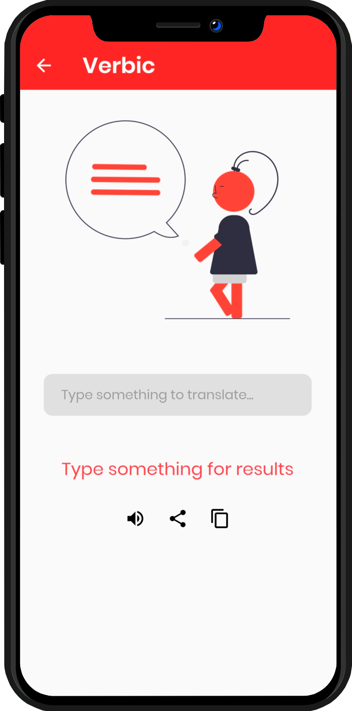
  </a>
  <a href="https://raw.githubusercontent.com/RishiAhuja/dictionary/master/assets/readme/light/6.png">
    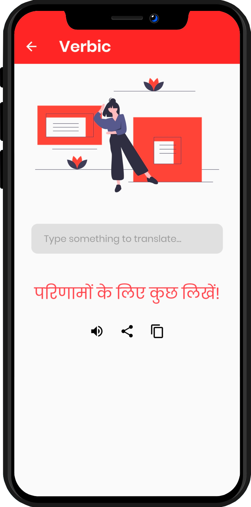
  </a>
 

## Dark mode
<a href="https://raw.githubusercontent.com/RishiAhuja/dictionary/master/assets/readme/dark/1.png">
    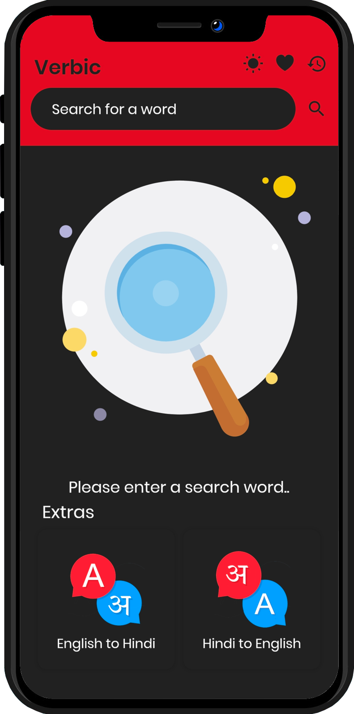
  </a>
<a href="https://raw.githubusercontent.com/RishiAhuja/dictionary/master/assets/readme/dark/2.png">
    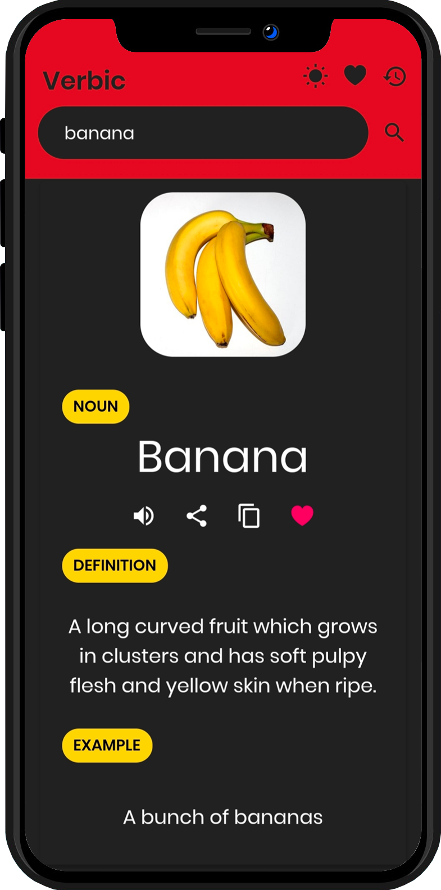
  </a>
<a href="https://raw.githubusercontent.com/RishiAhuja/dictionary/master/assets/readme/dark/3.png">
    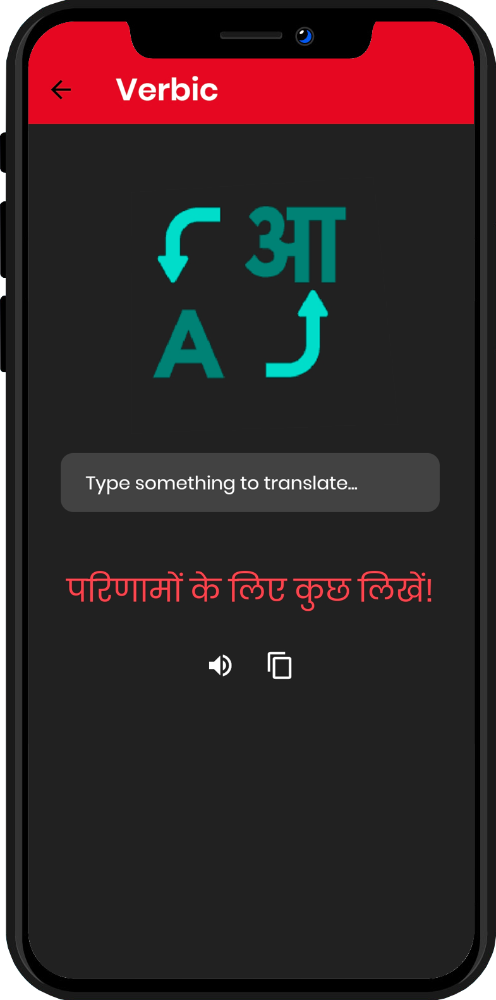
  </a>
  <a href="https://raw.githubusercontent.com/RishiAhuja/dictionary/master/assets/readme/dark/4.png">
    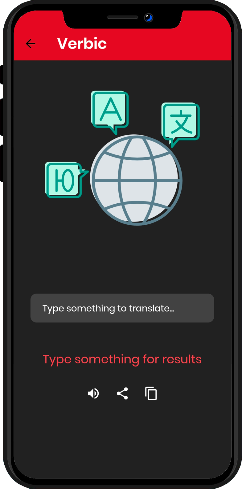
  </a>
  <a href="https://raw.githubusercontent.com/RishiAhuja/dictionary/master/assets/readme/dark/5.png">
    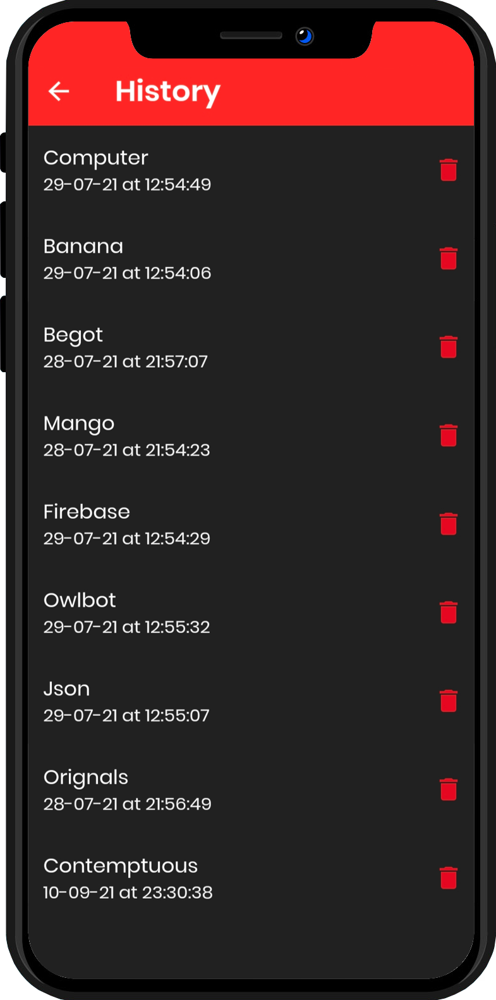
  </a>
  <a href="https://raw.githubusercontent.com/RishiAhuja/dictionary/master/assets/readme/dark/6.png">
    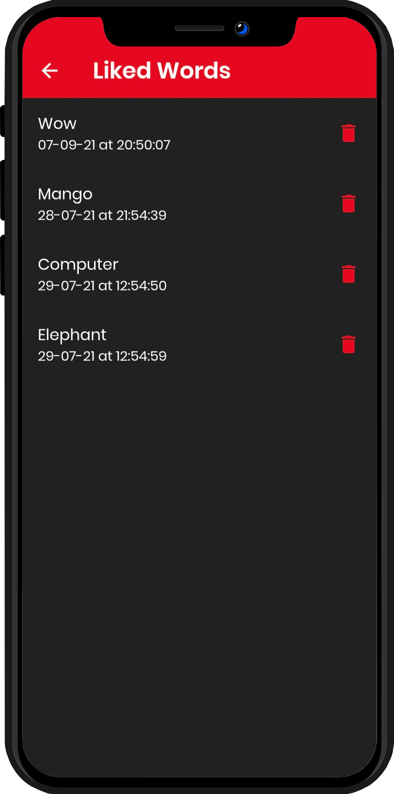
  </a>
 
Verbic is a open source dictionary with all the features you will ever need, This package includes iconic results, lottie animations, translation, powerful search bar, History tracking, like/bookmark counter & Dark mode. 

### Built With

* [Flutter](https://flutter.dev)
* [Firebase](https://firebase.google.com)
* [Owlbot.info](https://owlbot.info)

<!-- GETTING STARTED -->
## Getting Started

To get started you have to go to <a href='https://verbic.web.app'>Verbic</a> and type something in the search bar, you will probably get a releated image, part-of-speech, like button, pronounciation, definition, example etc.  
At the top right corner you will be provided with Like counter, history panel, and theme manager.

<!-- CONTACT -->
## Contact

Rishi Ahuja - [Github Portfolio](https://rishiahuja.github.io/my-portfolio)  
[Email](mailto:www.rishiahuja@gmail.com)  
Verbic: [Project link](https://github.com/RishiAhuja/dictionary) 

## Acknowledgements
* [Owlbot.info](https://owlbot.info)
* [Undraw](https://undraw.co)
* [Lottie Files](https://lottiefiles.com/)
* [Firebase Hosting](https://firebase.google.com)
* [Flat Icons](https://flaticon.com)
* [GitHub](https://github.com)

## Follow Me
<a href='https://instagram.com/_rishi__ahuja'> 
  </img>
</a>
<a href='https://www.youtube.com/channel/UCZF3uzRaNdRBSsBrHpQJXkA'> 
  </img>
</a>
<a href='https://www.facebook.com/rishi.ahuja.75470/'> 
  </img>
</a>

## Support me
<a href='https://buymeacoffee.com/RishiAhuja'> 
  </img>
</a>
<a href='https://patreon.com/RishiAhuja'> 
  </img>
</a>
